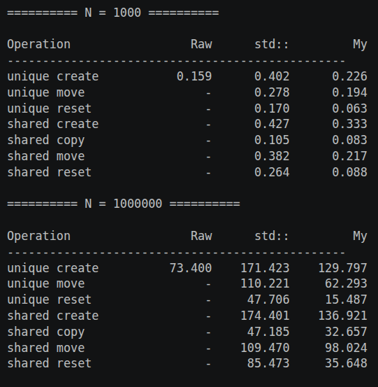
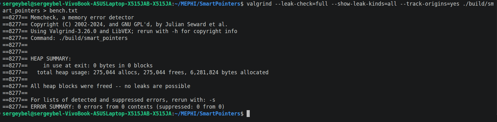

# SmartPointers
**Выполнил:** Беляцкий Сергей (Б25-511)  
Домашняя работа №1 - учебная реализация умных указателей (`UniquePtr`, `SharedPtr`) с использованием `ControlBlock`
- Для сборки проекта используется **CMake**
- Тесты написаны на **GoogleTest** 

## Время работы  

## Отчет Valgrind  
